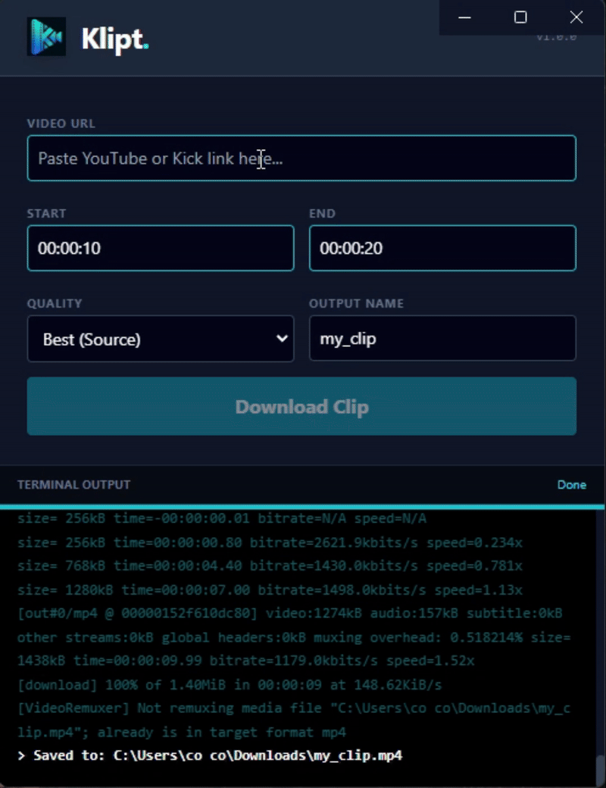

# Klipt

Klipt is a desktop video clipping tool for saving a specific section of a video as an MP4 file.

Paste a video URL, enter a start time and end time, choose a quality, and Klipt saves the clip to your Downloads folder. It is built for quick local clipping when you already know the part of a video you want to keep.



## What it does

- Clips video links by start and end time
- Saves clips locally as MP4 files
- Supports common video sites handled by yt-dlp, including YouTube, Twitch, and Kick
- Lets you choose source quality, 1080p, 720p, or 480p
- Installs and refreshes its clipping engine automatically

Klipt is a local utility. It does not host, publish, or distribute clips for you.

## How to use Klipt

1. Paste a video URL.
2. Enter a start time and end time in `HH:MM:SS` format.
3. Pick a quality.
4. Choose an output name.
5. Click `Download Clip`.

The finished MP4 is saved to your Downloads folder.

## Setup

Prerequisite: Node.js v16 or newer.

```bash
npm install
```

## Development

Run the app locally:

```bash
npm start
```

Build the Windows installer:

```bash
npm run dist
```

## How it works

Klipt is an Electron app that wraps yt-dlp and FFmpeg. The app downloads the yt-dlp engine into local app data, refreshes it when it gets stale, and uses FFmpeg for clipping/remuxing so the output is easy to play as an MP4.

## Stack

- Electron
- Node.js
- HTML and Tailwind CSS
- yt-dlp
- FFmpeg-static

## Responsible use

Klipt is intended for personal clipping, archiving, and offline review. Make sure your use follows the terms and rights that apply to the video you are clipping.
