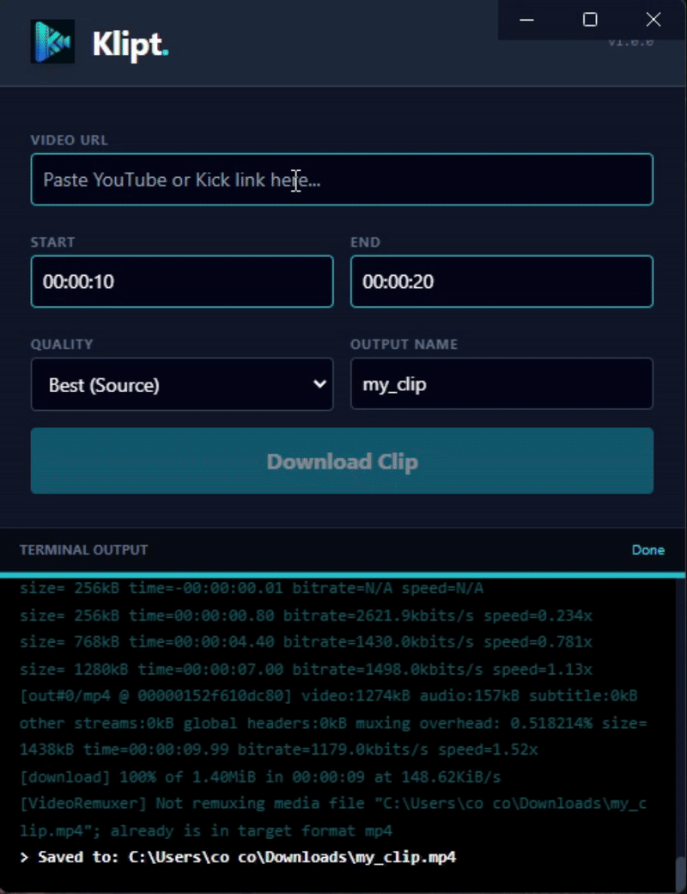

# Klipt

The ultimate desktop media clipper.



## Overview
Klipt is an Electron-based desktop utility for processing HLS streams and creating local archives. It wraps yt-dlp and ffmpeg, showcasing child-process management, binary orchestration, and cross-platform desktop architecture.

## Key features
- Precision clipping with frame-accurate start/end times
- Dynamic engine loading that installs the latest binaries on first run
- System resilience via wait-and-retry handling for Windows EBUSY locks
- Format interoperability by forcing MP4 containerization for universal playback

## Technical implementation
### Child process management
Klipt spawns dedicated processes for media handling so the main thread stays responsive. It uses `node:child_process` spawn to interface with the CLI backend and streams output to the renderer:
```js
// Stream terminal data to the renderer process
proc.stdout.on('data', (d) => {
  const str = d.toString();
  sender.send('terminal-data', str);
});
```

### Binary handling in production
To work around Electron ASAR packing limits (executables cannot run inside the archive), Klipt:
- Detects the OS environment
- Checks for external binaries in `userData`
- Downloads dependencies on demand when missing
- Points spawn to `app.asar.unpacked` for static assets like FFmpeg

## Setup
- Prerequisite: Node.js v16+
- Install dependencies: `npm install`

## Development
- Run locally: `npm start`
- Build for production (Windows/NSIS): `npm run dist`

## Stack
- Core: Electron, Node.js
- UI: HTML5, TailwindCSS
- Engine: yt-dlp, FFmpeg-static

## Disclaimer
Klipt is a graphical interface intended for personal archiving and offline analysis. Users are responsible for ensuring compliance with the Terms of Service of the platforms they utilize.
